<!--
  This is your PROFILE README. It goes in a repo named exactly after your
  username (e.g. github.com/Beno-Goulart/Beno-Goulart) so GitHub shows it on your profile.
  Replace the ALL-CAPS placeholders. Widths 370/490 keep the portrait and info
  card the same height -- if you change the info card's H, re-match these.
-->
<!-- <link href="https://fonts.googleapis.com/css2?family=JetBrains+Mono:wght@400;700&display=swap" rel="stylesheet">
 -->

<!-- ## Beno Goulart -->

<!-- **Full Stack Developer · Java & Spring Boot · Open Source Enthusiast** -->

<table>
<tr>
<td valign="top"></td>
<td valign="top"></td>
</tr>
</table>

<!-- GitHub metrics terminal, refreshed daily by the workflow -->
<table>
<tr>
<td>

</td>
</tr>
</table>

<!-- animated contribution graph, refreshed daily by the workflow -->

